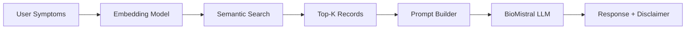

# 🩺 Medical RAG Chatbot (Symptoms → Possible Diseases)

An AI-powered medical assistant that suggests **possible diseases** based on user-reported symptoms using **Retrieval-Augmented Generation (RAG)** and open-source Large Language Models.

> 💬 Enter symptoms → 🔍 Retrieve relevant medical records → 🧠 Generate AI response → ⚠️ Show safety disclaimer

---

## 🚀 Overview

This project demonstrates an **end-to-end RAG pipeline** for medical symptom analysis:

- Natural language symptom input  
- Semantic retrieval over a disease–symptom knowledge base  
- Context-aware LLM generation using a medical-tuned model  
- GPU-optimized inference (Kaggle T4 compatible)

It is designed as a **portfolio-grade applied AI/NLP project** showcasing modern LLM system design.

> ⚠️ Educational use only — not for diagnosis or treatment.

---

## 🧠 Key Features

-  **Symptom Normalization & Cleaning**
-  **Semantic Search (SentenceTransformers)**
-  **Medical-tuned LLM (BioMistral 7B)**
-  **4-bit Quantized Inference (bitsandbytes)**
-  **CLI Chatbot Interface**
-  Optional **TF-IDF Baseline**
-  LoRA / QLoRA **Fine-tuning Pipeline** (in notebook)
-  Optimized for **Kaggle Dual T4 GPUs**

---

## 🏗️ System Architecture

---

## 💬 Example Interaction

**Input**

```text
fever, cough, sore throat, body aches
```

**Output**

```text
• Influenza
• Common cold

This is not a medical diagnosis. Please consult a licensed physician.
```

---

## 🧰 Tech Stack

| Layer            | Tools                |
| ---------------- | -------------------- |
|  LLM           | BioMistral 7B        |
|  Embeddings    | SentenceTransformers |
|  Quantization   | bitsandbytes (4-bit) |
|  ML Framework  | PyTorch              |
|  Vector Search | semantic_search      |
|  Preprocessing | Pandas               |
|  Baseline      | TF-IDF               |
|  Fine-tuning   | PEFT (LoRA / QLoRA)  |
|  Platform      | Kaggle / Local GPU   |

---

## 📁 Repository Structure

```text
medical-rag-chatbot/
│
├── medical_rag_chatbot.py        # Main runnable chatbot
├── README.md
├── requirements.txt
├── RUN.md
├── notebooks/
│   └── medical_chatbot_completed.ipynb
├── src/
└── data/
```

---

## 📊 Dataset Source (Kaggle)

This project uses the **Disease Symptom Prediction** dataset:

🔗 [https://www.kaggle.com/datasets/karthikudyawar/disease-symptom-prediction](https://www.kaggle.com/datasets/karthikudyawar/disease-symptom-prediction)

Only:

```
dataset.csv
```

is used.

Contains:

* `Disease`
* `Symptom_1 ... Symptom_n`

---

## ➕ How to Add Dataset in Kaggle

1. Open your notebook
2. Click **Input** (right sidebar)
3. Click **+ Add Input**
4. Search:

```
disease symptom prediction
```

or paste the URL above
5. Click **Add**

Dataset path becomes:

```bash
/kaggle/input/disease-symptom-prediction/dataset.csv
```

---

## 🧹 Dataset Processing Pipeline

Automatically performs:

* Replace `_` → spaces
* Merge symptom columns
* Remove duplicate symptom lists
* Group by disease

Final schema:

| Column   | Description             |
| -------- | ----------------------- |
| Disease  | Condition name          |
| Symptoms | Combined symptom string |

---

## ⚙️ Quickstart (Kaggle – Dual T4 GPU)

### Install Dependencies

```bash
pip install -r requirements.txt
```

or

```bash
pip install -U transformers accelerate sentencepiece bitsandbytes optimum sentence-transformers peft datasets
```

---

### Set Dataset Path

```bash
export SYMPTOM_DATASET=/kaggle/input/disease-symptom-prediction/dataset.csv
```

---

### Run Chatbot

```bash
python medical_rag_chatbot.py
```

---

## Local Setup

```bash
pip install -U transformers accelerate sentencepiece bitsandbytes optimum sentence-transformers peft datasets torch scikit-learn pandas
```

```bash
export SYMPTOM_DATASET=/path/to/dataset.csv
python medical_rag_chatbot.py
```

---

## Why BioMistral?

| Reason            | Benefit                |
| ----------------- | ---------------------- |
| 🧬 Medical-tuned  | Better terminology     |
| ⚡ 4-bit quantized | Fast inference         |
| 💾 Low VRAM       | T4 compatible          |
| 🧱 Stable         | No GPTQ install issues |

---

## ⚠️ Safety Disclaimer

This chatbot:

* ❌ Is **not** a doctor
* ❌ Does **not** detect emergencies
* ❌ Can hallucinate
* ❌ Does not give dosages

For production:

* Emergency detection
* Verified sources (CDC/NIH)
* Guardrails
* Monitoring
* Clinical evaluation

---

## 🎓 Academic Value

Demonstrates:

* Retrieval-Augmented Generation (RAG)
* Embedding-based semantic search
* Quantized LLM inference
* Medical NLP preprocessing
* GPU optimization
* ML system architecture design

---

## 🔮 Future Enhancements

* PubMed / NIH integration
* Citation generation
* Emergency intent detection
* Streamlit web UI
* Larger knowledge base
* Evaluation benchmarks
* Voice input
  
---

## 👥 Contributors

- **Julisa Delfin** – MS Data Science, DePaul University
[](https://www.linkedin.com/in/julisadelfin/)  
